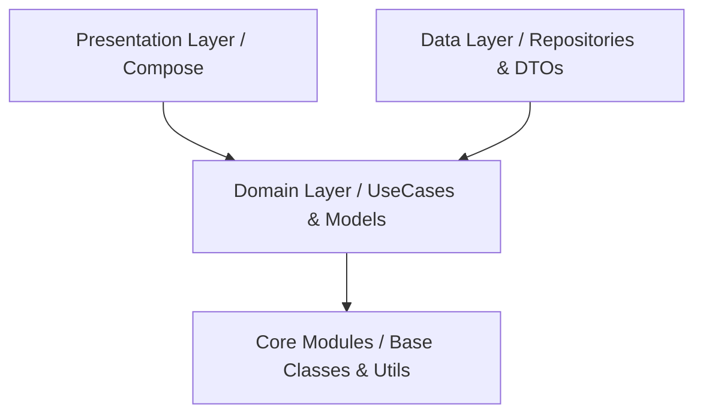

# پروژه KmpClean: معماری Clean در Kotlin Multiplatform

این پروژه یک نمونه پیاده‌سازی حرفه‌ای و مدرن از **Kotlin Multiplatform (KMP)** با استفاده از اصول **Clean Architecture** است. هدف اصلی این پروژه، نمایش چگونگی اشتراک‌گذاری حداکثری کد بین پلتفرم‌های مختلف (Android, iOS, Desktop, Web) در عین حفظ کیفیت، تست‌پذیری و قابلیت توسعه است.

## 🚀 اهداف پروژه
- **اشتراک‌گذاری منطق تجاری (Business Logic):** بیش از ۹۰٪ کدها در لایه Common نوشته شده‌اند.
- **رابط کاربری یکپارچه:** استفاده از **Compose Multiplatform** برای داشتن UI یکسان در تمام پلتفرم‌ها.
- **ساختار ماژولار:** تفکیک دقیق وظایف برای جلوگیری از درهم‌تنیدگی کدها (Decoupling).

---

## 🏗 ساختار معماری (Clean Architecture)

این پروژه از مدل لایه‌بندی استاندارد معماری پاک پیروی می‌کند:



### ۱. لایه Domain (هسته منطق)
- مستقل‌ترین لایه پروژه.
- شامل **Entity**ها، **UseCase**ها و تعریف **Repository**ها (Interface).
- هیچ وابستگی به کتابخانه‌های اندروید یا فریم‌ورک‌های خارجی ندارد.

### ۲. لایه Data (پیاده‌سازی داده‌ها)
- مسئول مدیریت داده‌ها از منابع مختلف (Network, Local Database).
- پیاده‌سازی Interfaceهای تعریف شده در لایه Domain.
- تبدیل مدل‌های شبکه (DTO) به مدل‌های Domain.

### ۳. لایه Presentation (رابط کاربری)
- استفاده از **Compose Multiplatform**.
- مدیریت وضعیت (State Management) با استفاده از **Voyager ScreenModel** (مشابه ViewModel).
- تفکیک UI به کامپوننت‌های کوچک و بازیافت‌پذیر در ماژول `designsystem`.

---

## 📦 ساختار ماژول‌ها

پروژه به صورت کاملاً ماژولار طراحی شده است:

- **`:composeApp`**: نقطه ورود برنامه برای تمام پلتفرم‌ها.
- **`:feature`**: شامل ماژول‌های مستقل برای هر قابلیت (مانند `home`, `registration`, `inquiry`).
- **`:core`**: زیرساخت‌های مشترک پروژه:
    - `:core:network`: تنظیمات Ktor و کلاینت شبکه.
    - `:core:domain`: کلاس‌های پایه لایه Domain.
    - `:core:data`: زیرساخت‌های ذخیره‌سازی و داده.
- **`:library`**: کتابخانه‌های کمکی:
    - `:library:designsystem`: تم‌ها، رنگ‌ها، فونت‌ها و کامپوننت‌های مشترک UI.
    - `:library:navigation`: مدیریت متمرکز مسیریابی (Navigation).

---

## 🛠 تکنولوژی‌های مورد استفاده

| تکنولوژی | کاربرد |
| :--- | :--- |
| **Kotlin Multiplatform** | اشتراک‌گذاری کد بین پلتفرم‌ها |
| **Compose Multiplatform** | طراحی رابط کاربری (UI) مشترک |
| **Koin** | تزریق وابستگی (Dependency Injection) |
| **Ktor** | ارتباطات شبکه و API |
| **Voyager** | مدیریت جابجایی بین صفحات (Navigation) |
| **Kotlinx Serialization** | تبدیل داده‌های JSON |
| **Coil3** | بارگذاری تصاویر به صورت Multiplatform |

---

## 💎 مزایای این معماری برای کسب‌وکارها

۱. **کاهش هزینه‌ها:** به جای استخدام تیم‌های مجزا برای Android و iOS، یک تیم کوچک می‌تواند هر دو پلتفرم (و حتی وب و دسکتاپ) را توسعه دهد.
۲. **سرعت در بازار (Time-to-Market):** پیاده‌سازی قابلیت‌های جدید همزمان برای تمام پلتفرم‌ها انجام می‌شود.
۳. **تست‌پذیری بالا:** به دلیل جدایی لایه‌ها، می‌توان منطق برنامه را بدون نیاز به Emulator یا دستگاه واقعی تست کرد.
۴. **نگهداری آسان:** باگ‌های منطقی (Logic Bugs) فقط یک‌بار در لایه مشترک اصلاح می‌شوند و در تمام پلتفرم‌ها اعمال می‌گردند.

---

## ⚙️ راهنمای اجرا

برای اجرای پروژه، کافیست از دستورات Gradle استفاده کنید:

- **اجرای نسخه دسکتاپ (JVM):**
  ```bash
  ./gradlew :composeApp:run
  ```
- **اجرای نسخه وب (JS):**
  ```bash
  ./gradlew :composeApp:jsBrowserRun
  ```
- **اجرای نسخه اندروید:**
  از طریق Android Studio دکمه Run را بزنید.

---

طراحی شده با ❤️ برای جامعه توسعه‌دهندگان Kotlin.
