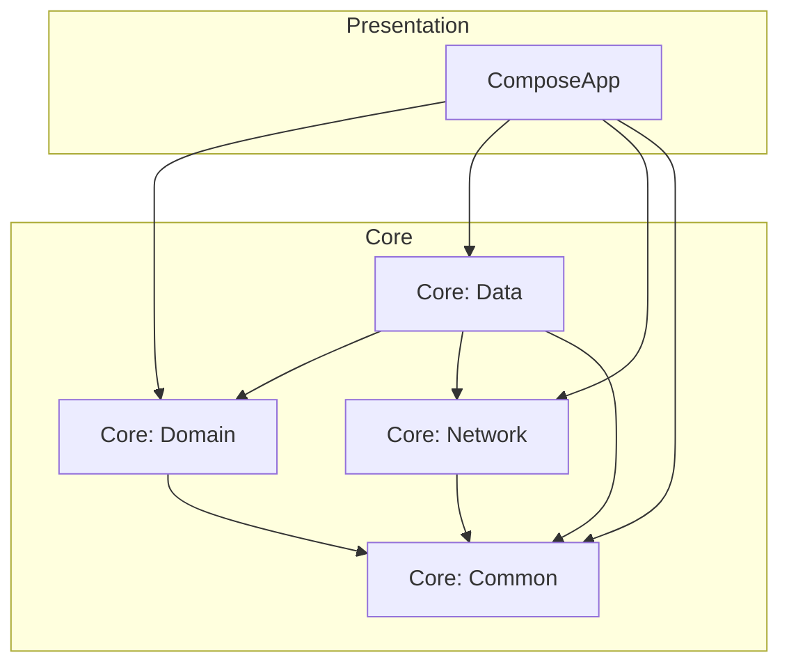

# KMP Clean Architecture Sample

A robust sample project demonstrating **Kotlin Multiplatform (KMP)** with **Compose Multiplatform**, built using **Clean Architecture** and **MVI (Model-View-Intent)** pattern.

Designed and developed by [Saman Khanbeiki](https://github.com/skhanbeiki).

## 🚀 Features

-   **Multiplatform Support**: Shared logic and UI across Android, iOS, Desktop (JVM), and Web (Wasm).
-   **Clean Architecture**: Strict separation of concerns into Domain, Data, Network, and Presentation layers.
-   **MVI Pattern**: Unidirectional data flow (State, Intent, Effect) for predictable state management.
-   **Modular Design**: Core functionalities are split into independent modules for better scalability.

## 🛠 Tech Stack

-   **[Kotlin Multiplatform](https://kotlinlang.org/docs/multiplatform.html)**: The core technology for sharing code.
-   **[Compose Multiplatform](https://www.jetbrains.com/lp/compose-multiplatform/)**: Declarative UI framework shared across platforms.
-   **[Koin](https://insert-koin.io/)**: Pragmatic Dependency Injection framework for Kotlin.
-   **[Voyager](https://voyager.adriel.cafe/)**: A pragmatic navigation library for Compose Multiplatform.
-   **[Ktor](https://ktor.io/)**: Asynchronous HTTP client for multiplatform networking.
-   **[Coroutines & Flow](https://kotlinlang.org/docs/coroutines-overview.html)**: For asynchronous programming and reactive data streams.

## 🏗 Architecture

This project follows the **Clean Architecture** principles to ensure that the business logic is independent of the UI and frameworks.

### Module Structure



-   **Core: Domain**: The heart of the application. Contains **Models**, **Repository Interfaces**, and **Use Cases**. It is purely Kotlin and platform-agnostic.
-   **Core: Data**: Implements the repository interfaces defined in the Domain layer. It handles data operations and coordinates between Network and Domain.
-   **Core: Network**: Manages API configurations and the **Ktor** HTTP client.
-   **Core: Common**: Contains shared utilities and constants used across modules.
-   **ComposeApp (Presentation)**: The entry point. It contains the UI screens, ViewModels, and Navigation logic.

### MVI Pattern (Presentation Layer)

The Presentation layer utilizes the **Model-View-Intent (MVI)** pattern to manage state effectively.

```mermaid
stateDiagram-v2
    [*] --> Intent
    Intent --> ViewModel : User Action / Event
    state ViewModel {
        Process --> Reduce : Update State
        Process --> SideEffect : Emit Effect
    }
    Reduce --> State : New State
    SideEffect --> Effect : One-time Event
    State --> UI : Render
    Effect --> UI : Show Toast / Navigate
    UI --> Intent : Trigger
```

-   **State**: Immutable data class representing the UI state (e.g., `Loading`, `Success`, `Error`).
-   **Intent**: Represents user actions or events (e.g., `RegisterClicked`, `LoadData`).
-   **Effect**: One-time side effects (e.g., `ShowSnackbar`, `NavigateToScreen`).

## 📂 Project Structure

```text
kmpclean/
├── composeApp/                 # Main Application Module (UI & Presentation)
│   ├── src/commonMain/kotlin/
│   │   └── .../presentation/   # Feature Screens (Registration, Payment, Inquiry)
│   │   └── .../di/             # Koin Modules
├── core/                       # Core Modules
│   ├── domain/                 # Business Logic (UseCases, Models, Repositories)
│   ├── data/                   # Data Implementation (Repository Impls)
│   ├── network/                # Network Client (Ktor)
│   └── common/                 # Shared Utilities
└── gradle/                     # Build configuration
```

## 📱 Features Implemented

The project includes three sample features to demonstrate the architecture:

1.  **Registration**: A screen handling user input, validation via UseCase, and API submission.
2.  **Payment**: A simulated payment flow using the MVI state machine.
3.  **Inquiry**: A data fetching scenario to demonstrate network calls and state loading.

## 🏃‍♂️ How to Run

### Android
Open the project in Android Studio and run the `composeApp` configuration.

### iOS
1.  Open `iosApp/iosApp.xcodeproj` in Xcode.
2.  Ensure you have your development team selected.
3.  Run on a Simulator or Device.

### Desktop (JVM)
Run the following Gradle command in the terminal:
```bash
./gradlew :composeApp:run
```

### Web (Wasm)
Run the following Gradle command:
```bash
./gradlew :composeApp:wasmJsBrowserDevelopmentRun
```

## 👤 Author

**Saman Khanbeiki**

-   GitHub: [github.com/skhanbeiki](https://github.com/skhanbeiki)
-   Email: [saman.khanbeiki@gmail.com](mailto:saman.khanbeiki@gmail.com)

---
*Built with ❤️ to demonstrate the power of Kotlin Multiplatform.*
